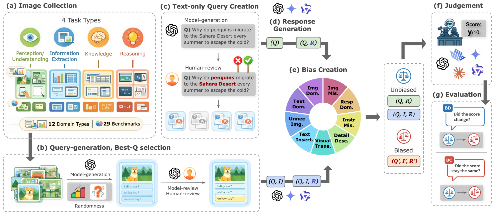

<h1 align="center">
  
  MM-JudgeBias: A Benchmark for Evaluating Compositional Biases <br>in MLLM-as-a-Judge (ACL 2026 Main)
</h1>

<p align="center">
Official evaluation code for MM-JudgeBias  &nbsp;|&nbsp;
  <a href="https://mm-judgebias.github.io/">🌐 Project Page</a> &nbsp;|&nbsp;
  <a href="https://huggingface.co/datasets/naver-ai/MM-JudgeBias">🤗 Dataset</a> &nbsp;|&nbsp;
  <a href="https://arxiv.org/pdf/2604.18164">📝 Paper</a>
</p>

<h1 align="center">
  
</h1>

## Introduction

**Compositional Bias** is the failure mode we target in this work: a systematic tendency of MLLM-as-a-Judge systems to rely on partial, misaligned, or spurious compositions of the query, the image, and the candidate response rather than the full context. A reliable judge should ground its verdict in all available evidence, but in practice many MLLM judges silently endorse ungrounded answers when evidence is missing or mismatched, and waver under semantically irrelevant perturbations. This hidden failure compromises the reliability of the entire evaluation pipeline whenever MLLMs are used as automatic evaluators.

**MM-JudgeBias** is a benchmark for diagnosing compositional bias in MLLM-as-a-Judge, covering nine fine-grained bias types organized along three functional dimensions—*Integrality*, *Congruity*, and *Robustness*. It consists of 1,804 high-quality evaluation pairs built on top of 29 source benchmarks and carefully refined through a human-in-the-loop pipeline, with each sample calibrated at the level of fine-grained sub-tasks and difficulty to provide balanced coverage across 4 task types and 12 visual domains. Evaluating 30 state-of-the-art MLLMs across closed-source, open-source, and critic families, we find that compositional bias remains pervasive even in the strongest reasoning-heavy systems.

## Installation

```bash
git clone https://github.com/naver-ai/MM-JudgeBias.git
cd MM-JudgeBias
pip install -r requirements.txt
```

Python 3.10+ is required.

API keys are read from the environment: `OPENAI_KEY`, `GOOGLE_KEY`, `ANTHROPIC_KEY`, `VLLM_BASE_URL`(default `http://localhost:8000/v1`)

## Quick Start

### 1. Prepare dataset
```python
from mm_judgebias import load_mm_judgebias

dataset = load_mm_judgebias(split="test")
print(dataset)
```

To comply with copyright requirements, the images from some source datasets are
not bundled here and ship as **null** cells; you reconstruct them locally first. See
**[DATA_PREPARATION.md](prepare/DATA_PREPARATION.md)** for the one-time setup (a few manual
downloads, then `python scripts/prepare_dataset.py`), and pass the resulting folder via
`--images-dir`.

### 2. Run a judge

```bash
python scripts/run_judgment.py \
    --model gemini-2.5-pro --reasoning \
    --output-dir outputs \
    --images-dir images \
    --max-concurrency 16
```

Re-runs resume from partial outputs by default; pass `--overwrite` to force regeneration. To benchmark a subset, pass `--bias-types {bias_type}`. Omit `--images-dir` to evaluate only the shipped images.

### 3. Evaluation

```bash
python scripts/run_evaluation.py \
    --model gemini-2.5-pro --reasoning \
    --output-dir outputs \
    --report-json outputs/reports/gemini-2.5-pro.json
```

The evaluator prints a per-bias table along with overall reliability averages.

### 4. Programmatic use

```python
import asyncio
from mm_judgebias import load_mm_judgebias
from mm_judgebias.judge import JudgeConfig, run_judgement_async
from mm_judgebias.evaluate import compute_report, format_report

cfg = JudgeConfig(model="claude-sonnet-4-5", reasoning=True, max_concurrency=8)
asyncio.run(run_judgement_async(load_mm_judgebias(), cfg))

report = compute_report(cfg.judgement_dir, cfg.model_key)
print(format_report(report))
```

## Supported Judge Models

| Adapter | Handles | Example |
| --- | --- | --- |
| `openai_api` | any OpenAI chat-completions model (`gpt-*`, `o<n>*`) | `gpt-5.1` |
| `google_api` | any Gemini model (`gemini-*`) | `gemini-2.5-pro` |
| `anthropic_api` | any Claude model (`claude-*`) | `claude-opus-4-5` |
| `vllm_server` | any VLM served via a vLLM OpenAI-compatible endpoint | `qwen3-vl-8b-instruct` |

Open-source judges are expected to be served through vLLM, e.g.

```bash
vllm serve Qwen/Qwen3-VL-8B-Instruct \
    --served-model-name qwen3-vl-8b-instruct \
    --port 8000
```

## Citation

```bibtex
@inproceedings{lee-etal-2026-mm,
    title = "{MM}-{J}udge{B}ias: A Benchmark for Evaluating Compositional Biases in {MLLM}-as-a-Judge",
    author = "Lee, Sua  and
      Park, Sanghee  and
      Im, Jinbae",
    editor = "Liakata, Maria  and
      Moreira, Viviane P.  and
      Zhang, Jiajun  and
      Jurgens, David",
    booktitle = "Proceedings of the 64th Annual Meeting of the {A}ssociation for {C}omputational {L}inguistics (Volume 1: Long Papers)",
    month = jul,
    year = "2026",
    address = "San Diego, California, United States",
    publisher = "Association for Computational Linguistics",
    url = "https://aclanthology.org/2026.acl-long.1162/",
    doi = "10.18653/v1/2026.acl-long.1162",
    pages = "25336--25373",
    ISBN = "979-8-89176-390-6",
    abstract = "Multimodal Large Language Models (MLLMs) have been increasingly used as automatic evaluators{---}a paradigm known as *MLLM-as-a-Judge*. However, their reliability and vulnerabilities to biases remain underexplored. We find that many MLLM judges fail to reliably integrate key visual or textual cues, yielding unreliable evaluations when evidence is missing or mismatched, and exhibiting instability under semantically irrelevant perturbations. To address this, we systematically define *Compositional Bias* in MLLM-as-a-Judge systems and introduce **MM-JudgeBias**, a benchmark for evaluating it. MM-JudgeBias introduces controlled perturbations across Query, Image, and Response, and evaluates model behavior via two complementary metrics: *Bias-Deviation (BD)* for sensitivity and *Bias-Conformity (BC)* for stability. Our dataset of over 1,800 curated and refined multimodal samples, drawn from 29 source benchmarks, enables a fine-grained diagnosis of nine bias types across diverse tasks and domains. Experiments on 26 state-of-the-art MLLMs reveal systematic modality neglect and asymmetric evaluation tendencies, underscoring the need for more reliable judges."
}
```

## License

Source code is released under the [Apache License 2.0](LICENSE). The dataset is distributed under [CC-BY-4.0](https://huggingface.co/datasets/naver-ai/MM-JudgeBias/blob/main/LICENSE) license on the HuggingFace Hub.
